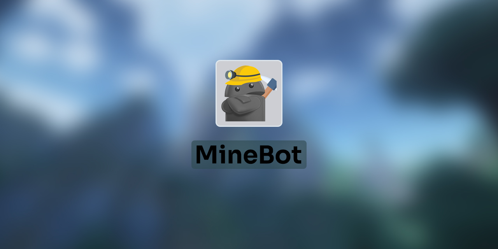

# Minebot


[Download & release][release-github-link]

## About

Minebot is a Discord bot originally used to start a Minecraft server, and now growing with different commands.

## Launch MineBot

If you want to use MineBot on your own, you need to add a `.env` file with different constant that the bot uses

```shell
DISCORDBOT_TOKEN=your_discord_bot_token
DISCORDBOT_CLIENT_ID=your_discord_bot_clientid
SCA_APIK_TOKEN=your_sca_api_token
```

[release-github-link]: https://github.com/Kiiow/minebot/releases